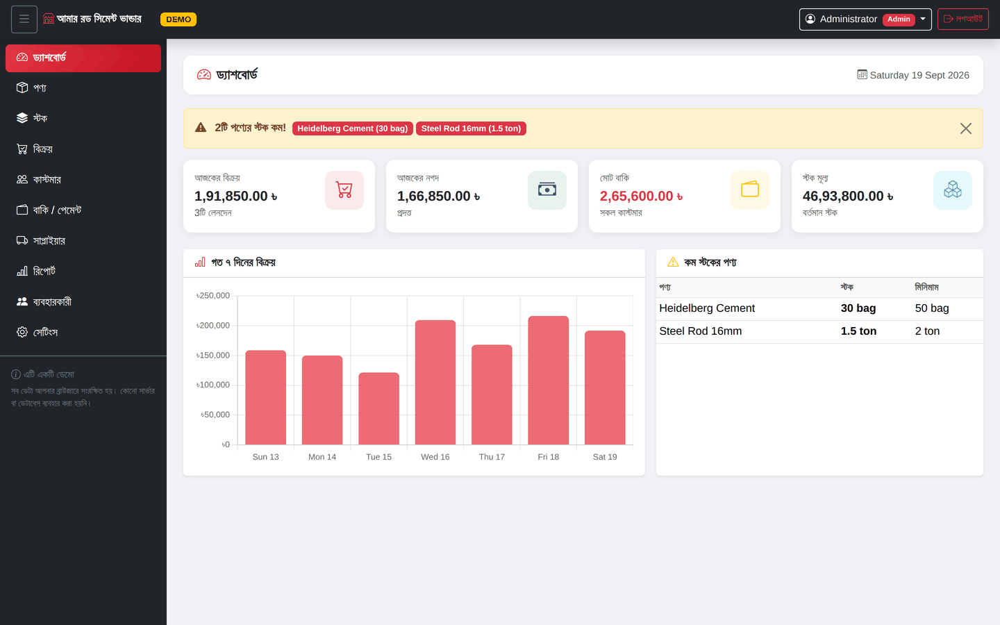
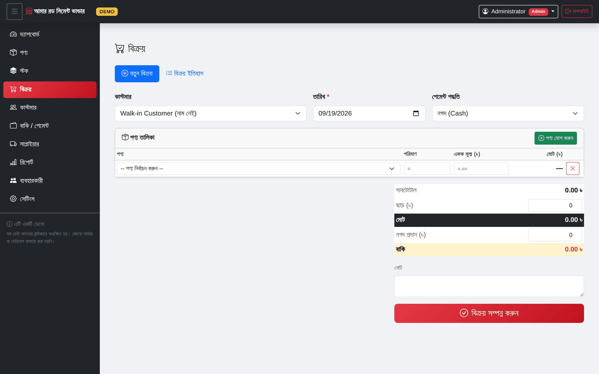
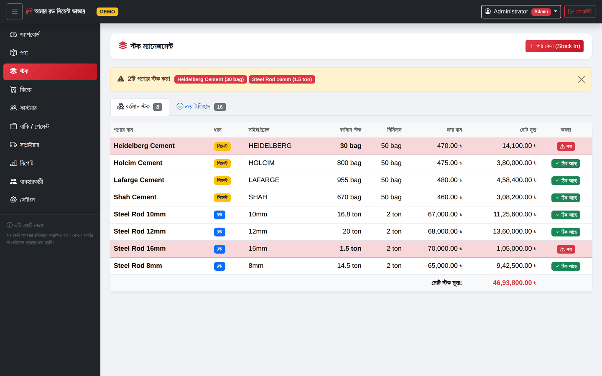
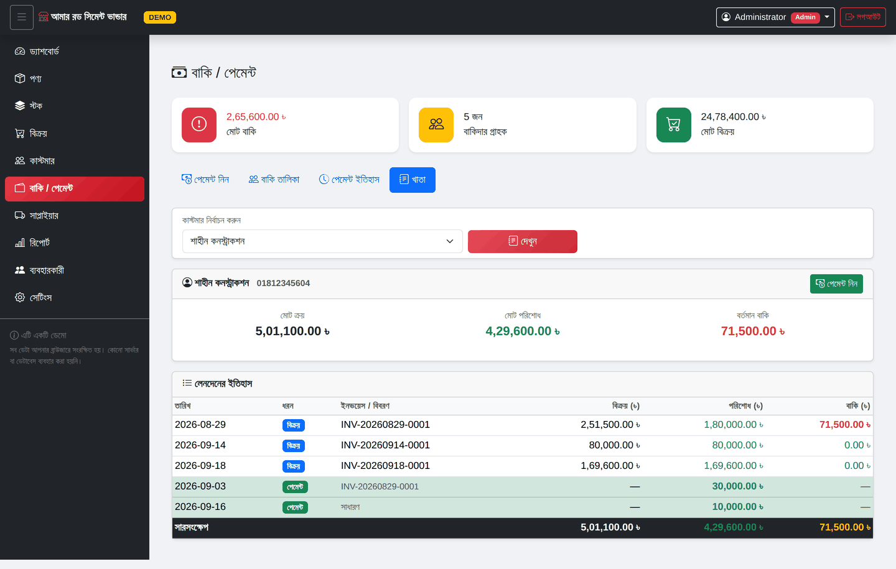
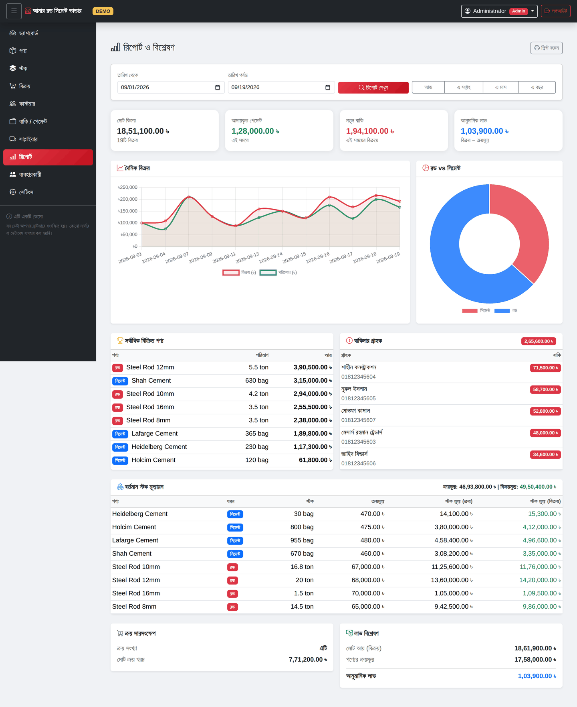
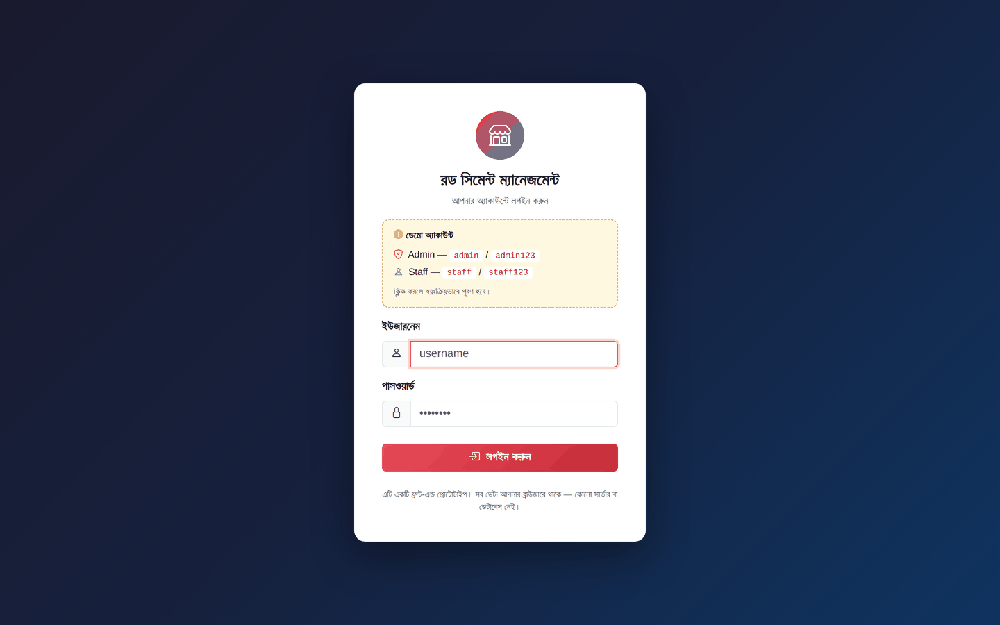
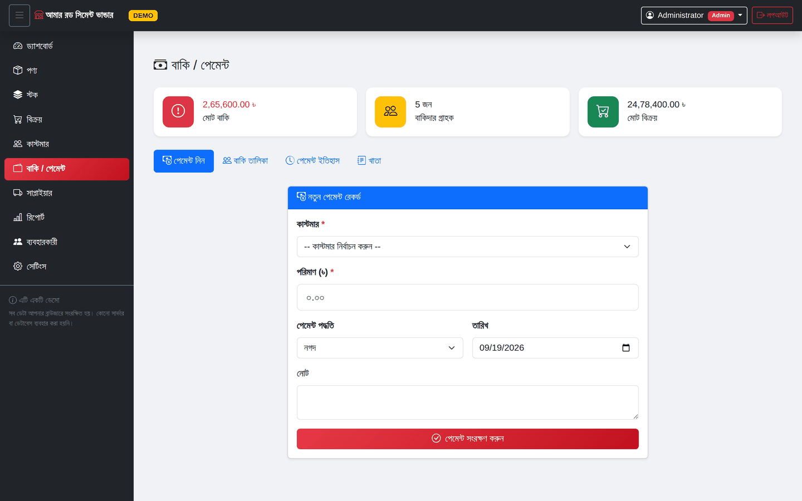
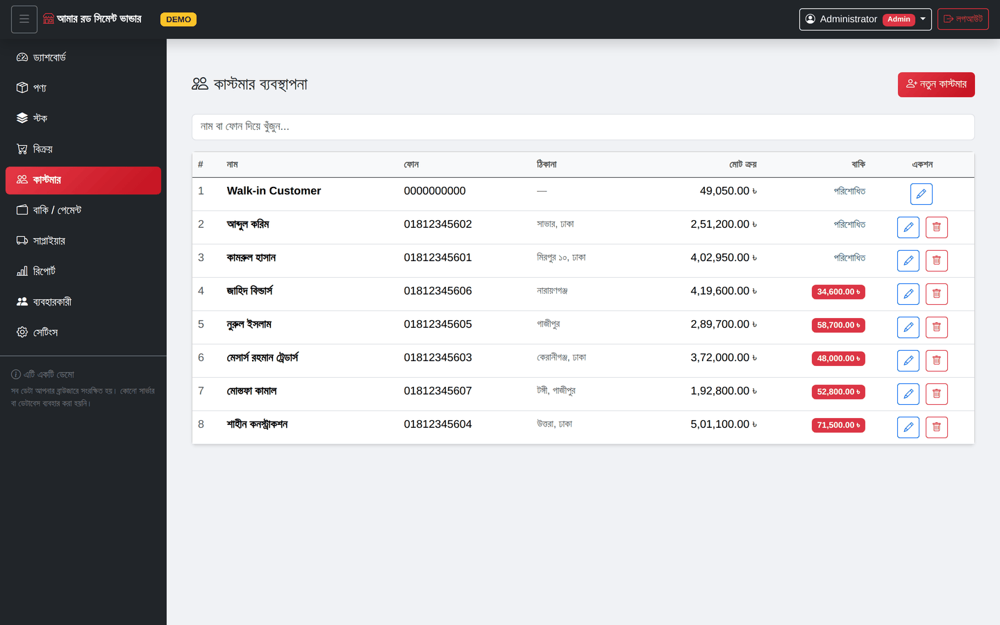
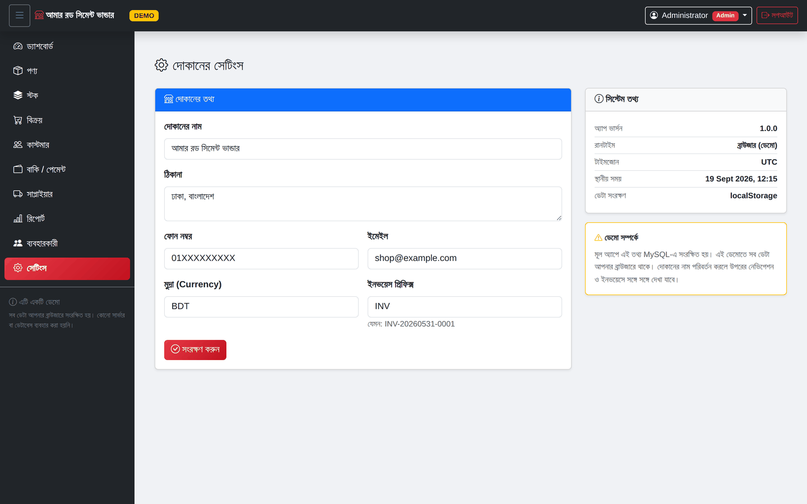
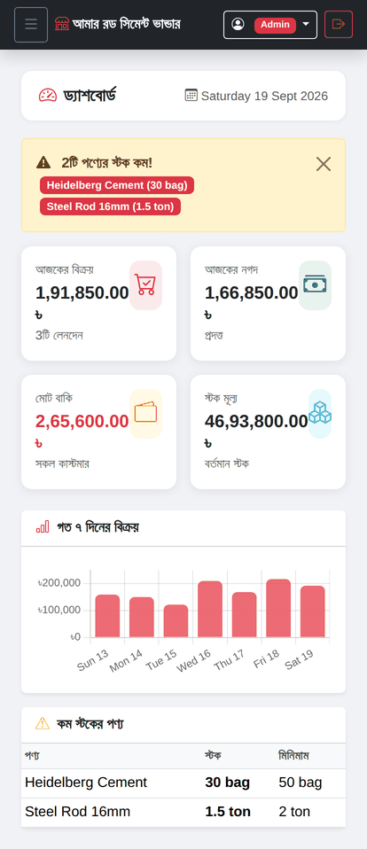

# Rod & Cement Shop Management System

A shop management system for a rod and cement retailer in Bangladesh — products,
stock, sales, customer credit (*khata*), payments and reporting.

Built with raw PHP (OOP, no framework) and MySQL. A database-free front-end
build of the same interface runs on GitHub Pages so the UI can be explored
without installing anything.

### ▶ [Open the live demo](https://arifbillahcse.github.io/Real-state-shop-managment-web-application/demo/)

| Role | Username | Password |
|---|---|---|
| Admin | `admin` | `admin123` |
| Staff | `staff` | `staff123` |

The credentials are shown on the login screen too. The demo stores everything in
your browser — no server, no database, nothing leaves your machine.



---

## What it does

**Sales** — multi-item invoicing with live stock checks, discounts, part payment,
and a printable invoice. A sale is refused if any line exceeds available stock.



**Stock** — current stock is derived from purchases minus completed sales, never
stored as a mutable counter. Products below their minimum level raise an alert on
the dashboard and the stock page.



**Khata (credit ledger)** — every customer's purchases and payments on one page,
with outstanding invoices, running dues and partial-payment handling.



**Reports** — daily sales, rod vs cement split, best sellers, stock valuation,
purchase summary and an estimated profit, over any date range.



**Also:** customers, suppliers, user accounts with roles, and shop settings.

<details>
<summary>More screenshots</summary>






</details>

Responsive down to phone width:



---

## Tech stack

| Layer | Used |
|---|---|
| Backend | Raw PHP 8, OOP, no framework |
| Database | MySQL with PDO prepared statements |
| Frontend | Bootstrap 5, vanilla JavaScript, AJAX |
| Charts | Chart.js |
| Demo build | Static HTML + localStorage, no backend |

## Design notes

**Derived values, not stored counters.** Current stock and customer dues are SQL
views (`vw_current_stock`, `vw_customer_dues`) rather than columns that have to be
kept in sync. Cancelling a sale returns its items to stock and clears the
customer's due without any extra bookkeeping — the status change is enough.

**Every write is guarded.** Products and suppliers with history cannot be deleted,
the last active admin cannot be demoted or disabled, a payment cannot exceed the
invoice's due, and a purchase record cannot be deleted if it would drive stock
negative.

**Role separation is enforced server-side.** Hiding a menu item is not access
control, so `api/_guard.php` re-checks login and admin rights on every endpoint.

**Passwords** are hashed with bcrypt (cost 12). Sessions regenerate their ID
periodically.

## Project structure

```
/
├── config/       # App + database configuration
├── classes/      # Database, User, Product, Stock, Sale, Payment, Report, Setting
├── includes/     # init.php bootstrap, header, sidebar, footer
├── pages/        # Dashboard, products, stock, sales, customers,
│                 # payments, suppliers, reports, users, settings
├── api/          # 34 AJAX endpoints, all returning {success, message, data}
├── assets/       # CSS, page scripts
├── sql/          # Schema, sample data and views
├── demo/         # Static front-end build for GitHub Pages
└── index.php     # Login
```

## Running the PHP app

Requires PHP 8+ and MySQL.

```bash
# 1. Create the database and load the schema
mysql -u root -p < sql/schema.sql

# 2. Point config/database.php at your MySQL credentials

# 3. Serve the project root
php -S localhost:8000
```

Then open <http://localhost:8000> and sign in as `admin` / `admin123`.
Change that password before putting this anywhere public.

## Running the demo build

Any static file server works — there is no build step:

```bash
cd demo
python3 -m http.server 8000
```

`demo/README.md` explains how the demo replaces the backend: it intercepts
`fetch()` for `/api/*.php` and answers from localStorage, which lets the original
page scripts run unmodified.

## Author

**Md Arif Billah** — web developer and system administrator, Dhaka.
